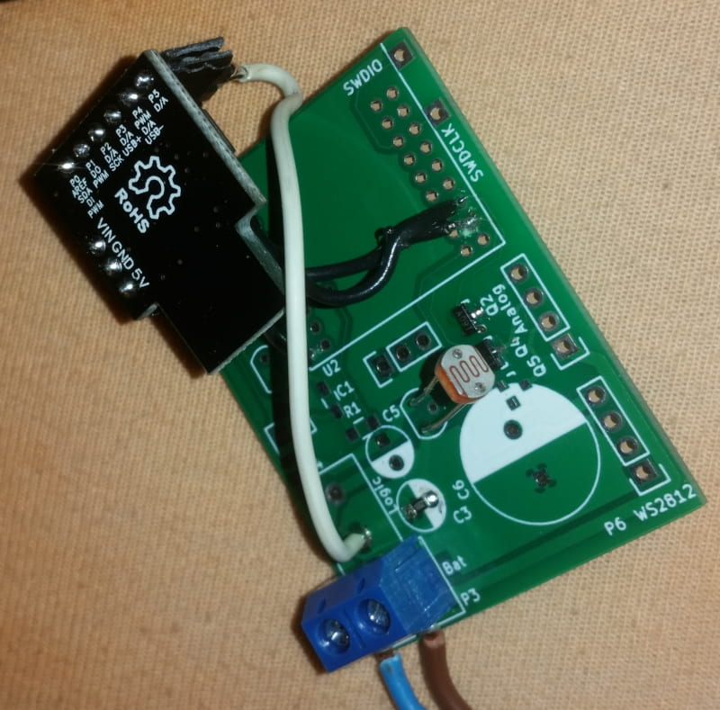

# nightlighting
This project is meant to control a (battery powered) light so it is only lid in the dark.

We use a small microcontroller (digispark/at tiny 85) for this very simple problem to have some easier to tune knobs than with an analog circuit.

Parts:
  * AT Tiny 85 (Digispark or clone)
  * 1-3 N-Channel Logic level fets for switching the lights (AO3400 or IRLML2502 or whatever you have)
  * LDR - light dependent resistor with any value
  * A resistor of approximately the value you measure at your LDR at the threshold between dark and light. Everything in the range 0.1 .. 10 times that value works perfectly fine
  * optionally a resistor divider of ~10:1 (10k and 100k) to measure the battery voltage

# Software
The software should ...
  * read LDR and filter to get a time constant of at least some seconds
  * evaluate the filtered value against a threshold (with hysteresis) to evaluate dark/bright
  * switch (or optionally PWM) the lights depending on the evaluated situation
  * optionally read the battery voltage, also filtered for at least a second, to disable/darken/whatever the lights on an empty battery

Find the software inside the `nightlighting` folder as `nightlighting.ino`.

## Configuration

* Debug: Uncomment the define of `SERIALUSB` to disable sleepmodes and enable a USB CDC serial port for debug output
* Pins: Define light pin outputs with `PIN_L1` and `PIN_L2`
* Pins: Define LDR input pin as analog pin number with `ANALOG_LDR`, battery resistor divider with `ANALOG_BATTERY`
* Light PWM: `PWM_LX_DARK` sets the pwm duty cycle when darkness is detected
* Light low battery: `PWM_LX_DARK_LOWBAT` sets the pwm duty cycle when darkness is detected but the battery is below the low charge state threshold
* Light day: `PWM_LX_LIGHT` sets pwm duty cycle when no darkness is detected
* Darkness threshold: `LDR_THRESHOLD` defines the threshold in ADC steps (0-1023) below which darkness is detected
* Darkness hysteresis: `LDR_HYSTERESIS` sets a hysteresis in raw ADC steps that needs to be overcome whenever the raw value moves around the threshold
* Battery empty: `BATTERY_THRESHOLD` sets the threshold in millivolts (mV) below which the lights operate in low battery mode
* Battery empty hysteresis: `BATTERY_HYSTERESIS` defines a hysteresis in raw ADC steps (~30 mV with suggested resistor divider)
* Filtering: Battery voltage and darkness are filtered with a very simple IIR first order low pass filter.
  * `LDR_FILTER_COEF_LOG2` has a 1/(2^x) impact on the frequency, range can be from 0 to 21
  * `BATTERY_FILTER_COEF_LOG2` does the same for the battery voltage filter
  * `SAMPLE_TIME_MILLIS` defines the base sample rate of the whole application as well as the filter

# Prototype
For my prototype, I could reuse some PCBs I had lying around as leftovers from an old WS2801 project.
It acts as a base PCB for all parts, the digispark is connected via wires.

